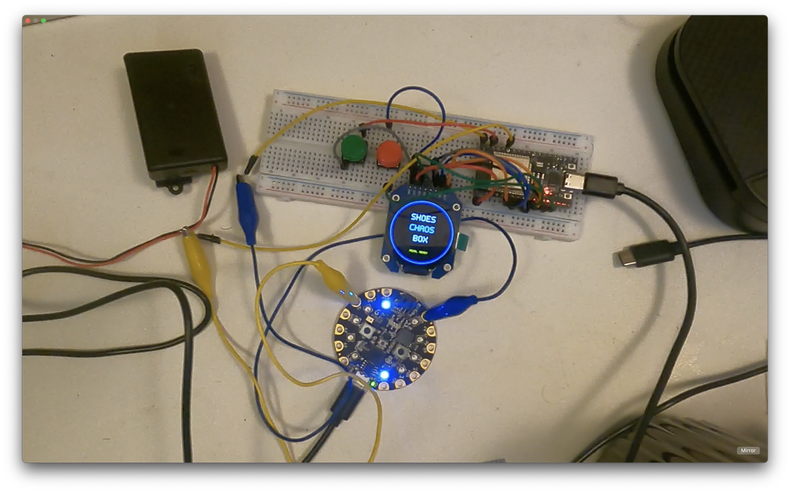
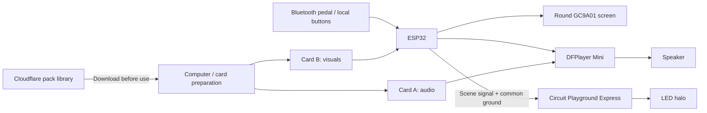

# Shoes Off, Dirtbag!

**A funny shoe-removal reminder, and a working experiment in making hardware, media, and software agree.** Built by [Reed Verdesoto](https://reedverde.com/shoes-off-dirtbag/).

A foot pedal starts a short scene on a round screen. A speaker supplies the line. A ring of LEDs gives it some attitude. The idea began as a reminder to leave dirty shoes at the door; the current build is a manually triggered bench prototype being turned into a wearable for Tech Week.

This repository records the decisions, mistakes, measurements, and code behind that proof of concept. Reed directed the build and tested the physical behavior while working with coding agents on firmware, media preparation, and debugging. The goal is to make the reasoning inspectable and useful to someone building a similar device.

[Proof-of-concept release](https://github.com/Reedverde/shoes-chaos-box/releases/tag/poc-2026-09-27) · [Read the story](https://reedverde.com/shoes-off-dirtbag/) · [Start a similar build](docs/GETTING_STARTED.md) · [Content pack service](cloudflare/chaos-director/README.md) · [Audit findings](docs/AUDIT.md)



*An early September 2026 bench test, before the final wiring and timing repair.*

## What works today

| Part | Current result |
|---|---|
| Playback | 32 scenes, including three six-second Kling AI loops; two microSD cards; no Wi-Fi required |
| Inputs | Bluetooth pedal and local forward/previous buttons; scene order survives restarts |
| Lights | Circuit Playground Express with scene-specific patterns and continuous chases |
| Special display | Right pedal in Mode 5 cycles QR → silent Arc Core → home; Mode 4 directly toggles Arc Core |
| Timing | All 1,055 normal frames displayed in the full-catalog bench test; 31 scenes ended 10 ms over target and one 58 ms over |
| Cloudflare | Content-pack downloads, canonical catalog, and deterministic playlist previews |
| Still ahead | Wearable mounting, diffuser approval, repeated physical control checks, and a five-hour battery test |

The latest pedal cycle passes control-loop tests and was installed. Its full physical two-cycle acceptance test remains on the checklist. The timing results are measured scene completion, not sample-accurate audiovisual sync; frame starts still had up to 64.362 ms jitter.

## How it fits together



Cloudflare handles preparation and distribution. The performance runs locally. The new public starter download contains original test shapes and tones; the performance clips are not bundled with it. Playlist previews are planning tools, not a replacement for the firmware's ordered 32-scene catalog.

## Try it without hardware

Use Node.js 22 or newer:

```sh
git clone https://github.com/Reedverde/shoes-chaos-box.git
cd shoes-chaos-box/cloudflare/chaos-director
npm ci
npm test
npm run dev
```

Open the local address Wrangler prints. Download the starter ZIP or choose a playlist and seed. The same seed reproduces the same preview order. See [Cloudflare setup and deployment](docs/CLOUDFLARE.md).

For the physical device, begin with [Getting started](docs/GETTING_STARTED.md). It identifies the two active firmware projects, GPIO wiring, card formats, and checks to perform before flashing. Older experiments remain in the repository as history and are clearly separated from the active build.

## What I learned from the slow playback

The screen looked as if it was playing each frame too long. Measurements showed the card reader taking about 372 ms to read an image whose scheduled hold could be only 100–300 ms. Direct reads at a tested 16 MHz brought the average to 95 ms. A faster 20 MHz setting failed, so it was rejected. The LED code also needed to send complete patterns once per frame and calculate chase position from elapsed time.

The repair preserved the media and checked the actual hardware. [Read the measurements and limits](firmware/TIMING_REPAIR_2026-09-27.md), or inspect the [32-scene results](docs/validation/scene-results.csv).

## Find your way around

| Looking for… | Start here |
|---|---|
| Live links and publication status | [Publication handoff](docs/PUBLICATION.md) |
| Build instructions and active firmware | [Getting started](docs/GETTING_STARTED.md) |
| System decisions and current state | [PROJECT_STATE.md](PROJECT_STATE.md) |
| Cloudflare hosting, downloads, API, and where Flue fits | [Cloudflare guide](docs/CLOUDFLARE.md) |
| Controls and short demo sequence | [Demo guide](docs/DEMO.md) |
| Current GPIO and breadboard notes | [Bench rewire record](firmware/BENCH_REWIRE_PROGRESS.md) |
| Media preparation and reuse boundaries | [Media guide](docs/MEDIA.md) |
| Kling AI provenance | [Kling integration](KLING_AI_INTEGRATION.md) |
| Arc Core animation and lighting | [Special scenes](SPECIAL_SCENES.md) |
| Audit findings and remaining risks | [Audit](docs/AUDIT.md) |
| Physical build and acceptance checklist | [TODO.md](TODO.md) |
| Parts already owned and still needed | [Gear master](GEAR_MASTER.md), [purchase list](PURCHASE_LIST.md) |

## Hack Alcatraz

Built for [Hack Alcatraz with Cloudflare and Kling AI](https://www.tech-week.com/calendar/sf/events/hack-alcatraz-with-cloudflare-and-kling-ai-85ba1851-ec51-40cf-904f-edfd4f9a66a8), October 5, 2026. The organizer asks for fun builds and short demos; Cloudflare or Kling AI use earns optional bonus consideration. This project uses a Cloudflare Worker with Static Assets and three Kling-generated normal scenes, plus the separate Arc Core special. **Flue is not a runtime dependency.** The [integration guide](docs/CLOUDFLARE.md) explains a possible future Flue extension without claiming it is implemented.

The five-hour battery target and wearable fit are requirements to test, not completed results. Automatic doorway detection is a future home version. A dedicated emergency-stop/mute input is not implemented.

## Reuse and contribution

Questions and small, reproducible improvements are welcome through GitHub issues and pull requests. Include your board variant, firmware version, media pack, and expected versus observed behavior. Keep credentials, serial device identifiers, and private source media out of reports.

This is publicly viewable source, not a licensed open-source release. No repository-wide license grant has been selected. Existing embedded fallback artwork and third-party performance references have separate rights; do not assume visibility grants redistribution permission. See [media and reuse notes](docs/MEDIA.md).
