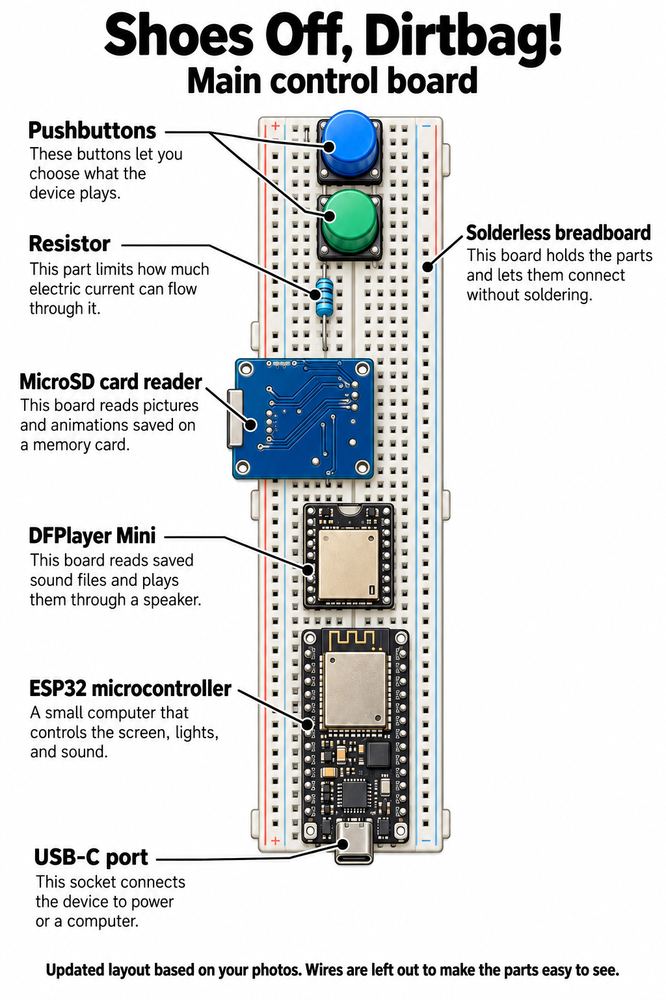
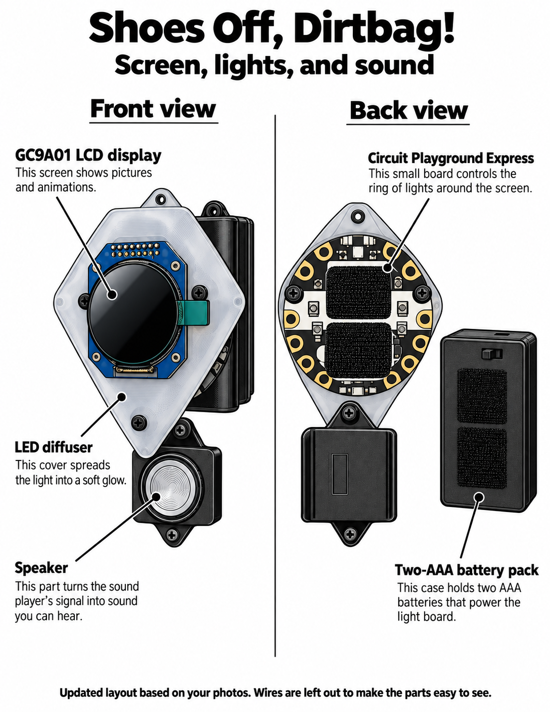

# Component diagrams

Updated October 2, 2026, from Reed's photos of the current component locations. The wires are left out to make the parts easy to see. Each label gives the component name and a short explanation.

## Main control board

| Component | What it is and does |
|---|---|
| Pushbuttons | These buttons let you choose what the device plays. |
| Resistor | This part limits how much electric current can flow through it. |
| MicroSD card reader | This board reads pictures and animations saved on a memory card. |
| DFPlayer Mini | This board reads saved sound files and plays them through a speaker. |
| ESP32 microcontroller | A small computer that controls the screen, lights, and sound. |
| USB-C port | This socket connects the device to power or a computer. |
| Solderless breadboard | This board holds the parts and lets them connect without soldering. |

## Screen, lights, and sound

| Component | What it is and does |
|---|---|
| GC9A01 LCD display | This screen shows pictures and animations. |
| LED diffuser | This cover spreads the light into a soft glow. |
| Circuit Playground Express | This small board controls the ring of lights around the screen. |
| Speaker | This part turns the sound player's signal into sound you can hear. |
| Two-AAA battery pack | This case holds two AAA batteries that power the light board. |

For electrical connections, see the [getting started guide](GETTING_STARTED.md) and [bench wiring notes](../firmware/BENCH_REWIRE_PROGRESS.md).
